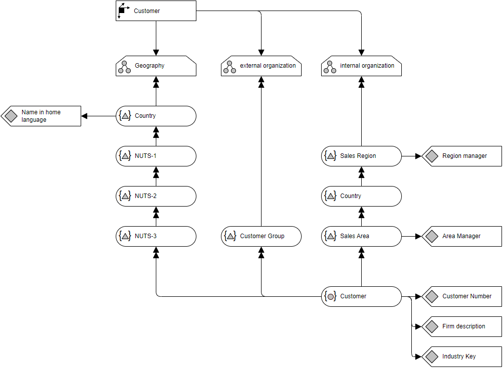

# Overview for Diagram **Lakritzschnecke**:
## Shapes with Tooltip beginning 'ADAPT'
- **ID:** sCMjGG6YAH0hTthaaUGF-23, **Label:** Geography, **ADAPT Type:** Hierarchy
- **ID:** sCMjGG6YAH0hTthaaUGF-31, **Label:** Country, **ADAPT Type:** HierarchyLevel
- **ID:** sCMjGG6YAH0hTthaaUGF-35, **Label:** Customer, **ADAPT Type:** DimensionMember
- **ID:** sCMjGG6YAH0hTthaaUGF-39, **Label:** Firm description, **ADAPT Type:** Attribute
- **ID:** sCMjGG6YAH0hTthaaUGF-42, **Label:** Customer, **ADAPT Type:** Dimension
- **ID:** sCMjGG6YAH0hTthaaUGF-53, **Label:** external organization, **ADAPT Type:** Hierarchy
- **ID:** sCMjGG6YAH0hTthaaUGF-61, **Label:** internal organization, **ADAPT Type:** Hierarchy
- **ID:** sCMjGG6YAH0hTthaaUGF-69, **Label:** Customer Group, **ADAPT Type:** HierarchyLevel
- **ID:** sCMjGG6YAH0hTthaaUGF-73, **Label:** NUTS-1, **ADAPT Type:** HierarchyLevel
- **ID:** sCMjGG6YAH0hTthaaUGF-77, **Label:** NUTS-3, **ADAPT Type:** HierarchyLevel
- **ID:** sCMjGG6YAH0hTthaaUGF-81, **Label:** NUTS-2, **ADAPT Type:** HierarchyLevel
- **ID:** sCMjGG6YAH0hTthaaUGF-88, **Label:** Sales Region, **ADAPT Type:** HierarchyLevel
- **ID:** sCMjGG6YAH0hTthaaUGF-92, **Label:** Sales Area, **ADAPT Type:** HierarchyLevel
- **ID:** sCMjGG6YAH0hTthaaUGF-102, **Label:** Customer Number, **ADAPT Type:** Attribute
- **ID:** sCMjGG6YAH0hTthaaUGF-106, **Label:** Area Manager, **ADAPT Type:** Attribute
- **ID:** sCMjGG6YAH0hTthaaUGF-109, **Label:** Region manager, **ADAPT Type:** Attribute
- **ID:** sCMjGG6YAH0hTthaaUGF-114, **Label:** Name in home language, **ADAPT Type:** Attribute
- **ID:** sCMjGG6YAH0hTthaaUGF-118, **Label:** Country, **ADAPT Type:** HierarchyLevel
- **ID:** sCMjGG6YAH0hTthaaUGF-124, **Label:** Industry Key, **ADAPT Type:** Attribute

## Connections with Tooltip beginning 'ADAPT'
- **ID:** sCMjGG6YAH0hTthaaUGF-22, **Label:** , **Source:** sCMjGG6YAH0hTthaaUGF-42, **Target:** sCMjGG6YAH0hTthaaUGF-23, **ADAPT Type:** LoosePrecedence, **Start Arrow:** none, **End Arrow:** block
- **ID:** sCMjGG6YAH0hTthaaUGF-50, **Label:** , **Source:** sCMjGG6YAH0hTthaaUGF-31, **Target:** sCMjGG6YAH0hTthaaUGF-23, **ADAPT Type:** StrictPrecedence, **Start Arrow:** none, **End Arrow:** doubleBlock
- **ID:** sCMjGG6YAH0hTthaaUGF-51, **Label:** , **Source:** sCMjGG6YAH0hTthaaUGF-35, **Target:** sCMjGG6YAH0hTthaaUGF-77, **ADAPT Type:** StrictPrecedence, **Start Arrow:** none, **End Arrow:** doubleBlock
- **ID:** sCMjGG6YAH0hTthaaUGF-52, **Label:** , **Source:** sCMjGG6YAH0hTthaaUGF-35, **Target:** sCMjGG6YAH0hTthaaUGF-39, **ADAPT Type:** LoosePrecedence, **Start Arrow:** none, **End Arrow:** block
- **ID:** sCMjGG6YAH0hTthaaUGF-85, **Label:** , **Source:** sCMjGG6YAH0hTthaaUGF-73, **Target:** sCMjGG6YAH0hTthaaUGF-31, **ADAPT Type:** StrictPrecedence, **Start Arrow:** none, **End Arrow:** doubleBlock
- **ID:** sCMjGG6YAH0hTthaaUGF-86, **Label:** , **Source:** sCMjGG6YAH0hTthaaUGF-81, **Target:** sCMjGG6YAH0hTthaaUGF-73, **ADAPT Type:** StrictPrecedence, **Start Arrow:** none, **End Arrow:** doubleBlock
- **ID:** sCMjGG6YAH0hTthaaUGF-87, **Label:** , **Source:** sCMjGG6YAH0hTthaaUGF-77, **Target:** sCMjGG6YAH0hTthaaUGF-81, **ADAPT Type:** StrictPrecedence, **Start Arrow:** none, **End Arrow:** doubleBlock
- **ID:** sCMjGG6YAH0hTthaaUGF-96, **Label:** , **Source:** sCMjGG6YAH0hTthaaUGF-69, **Target:** sCMjGG6YAH0hTthaaUGF-53, **ADAPT Type:** StrictPrecedence, **Start Arrow:** none, **End Arrow:** doubleBlock
- **ID:** sCMjGG6YAH0hTthaaUGF-97, **Label:** , **Source:** sCMjGG6YAH0hTthaaUGF-92, **Target:** sCMjGG6YAH0hTthaaUGF-118, **ADAPT Type:** StrictPrecedence, **Start Arrow:** none, **End Arrow:** doubleBlock
- **ID:** sCMjGG6YAH0hTthaaUGF-98, **Label:** , **Source:** sCMjGG6YAH0hTthaaUGF-42, **Target:** sCMjGG6YAH0hTthaaUGF-53, **ADAPT Type:** LoosePrecedence, **Start Arrow:** none, **End Arrow:** block
- **ID:** sCMjGG6YAH0hTthaaUGF-99, **Label:** , **Source:** sCMjGG6YAH0hTthaaUGF-42, **Target:** sCMjGG6YAH0hTthaaUGF-61, **ADAPT Type:** LoosePrecedence, **Start Arrow:** none, **End Arrow:** block
- **ID:** sCMjGG6YAH0hTthaaUGF-100, **Label:** , **Source:** sCMjGG6YAH0hTthaaUGF-35, **Target:** sCMjGG6YAH0hTthaaUGF-69, **ADAPT Type:** StrictPrecedence, **Start Arrow:** none, **End Arrow:** doubleBlock
- **ID:** sCMjGG6YAH0hTthaaUGF-101, **Label:** , **Source:** sCMjGG6YAH0hTthaaUGF-35, **Target:** sCMjGG6YAH0hTthaaUGF-92, **ADAPT Type:** StrictPrecedence, **Start Arrow:** none, **End Arrow:** doubleBlock
- **ID:** sCMjGG6YAH0hTthaaUGF-105, **Label:** , **Source:** sCMjGG6YAH0hTthaaUGF-35, **Target:** sCMjGG6YAH0hTthaaUGF-102, **ADAPT Type:** LoosePrecedence, **Start Arrow:** none, **End Arrow:** block
- **ID:** sCMjGG6YAH0hTthaaUGF-112, **Label:** , **Source:** sCMjGG6YAH0hTthaaUGF-92, **Target:** sCMjGG6YAH0hTthaaUGF-106, **ADAPT Type:** LoosePrecedence, **Start Arrow:** none, **End Arrow:** block
- **ID:** sCMjGG6YAH0hTthaaUGF-113, **Label:** , **Source:** sCMjGG6YAH0hTthaaUGF-88, **Target:** sCMjGG6YAH0hTthaaUGF-109, **ADAPT Type:** LoosePrecedence, **Start Arrow:** none, **End Arrow:** block
- **ID:** sCMjGG6YAH0hTthaaUGF-117, **Label:** , **Source:** sCMjGG6YAH0hTthaaUGF-31, **Target:** sCMjGG6YAH0hTthaaUGF-114, **ADAPT Type:** LoosePrecedence, **Start Arrow:** none, **End Arrow:** block
- **ID:** sCMjGG6YAH0hTthaaUGF-122, **Label:** , **Source:** sCMjGG6YAH0hTthaaUGF-88, **Target:** sCMjGG6YAH0hTthaaUGF-61, **ADAPT Type:** StrictPrecedence, **Start Arrow:** none, **End Arrow:** doubleBlock
- **ID:** sCMjGG6YAH0hTthaaUGF-123, **Label:** , **Source:** sCMjGG6YAH0hTthaaUGF-118, **Target:** sCMjGG6YAH0hTthaaUGF-88, **ADAPT Type:** StrictPrecedence, **Start Arrow:** none, **End Arrow:** doubleBlock
- **ID:** sCMjGG6YAH0hTthaaUGF-127, **Label:** , **Source:** sCMjGG6YAH0hTthaaUGF-35, **Target:** sCMjGG6YAH0hTthaaUGF-124, **ADAPT Type:** LoosePrecedence, **Start Arrow:** none, **End Arrow:** block

### And here we also have the diagram:

